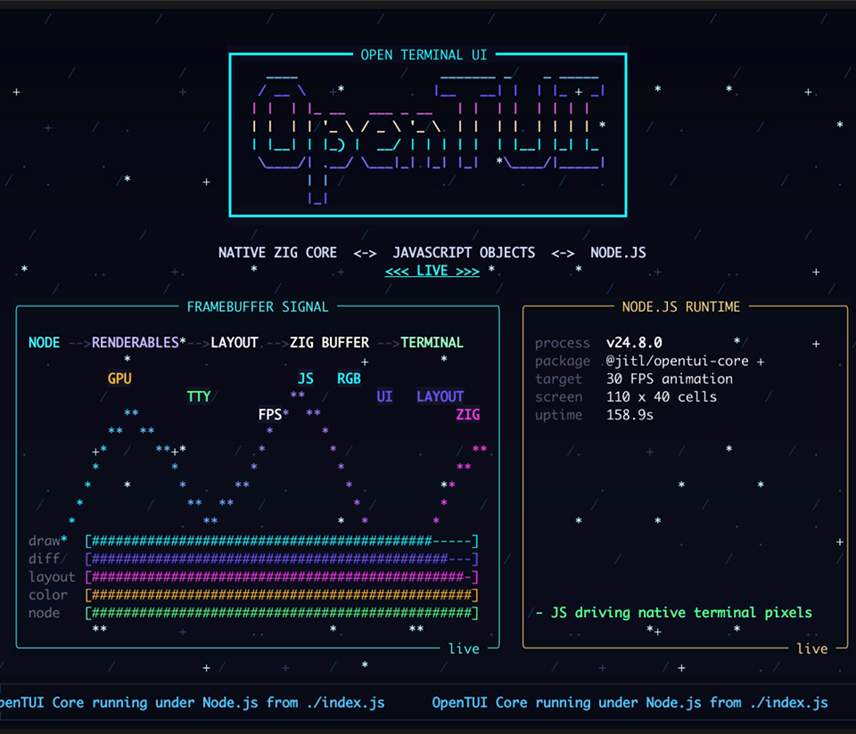
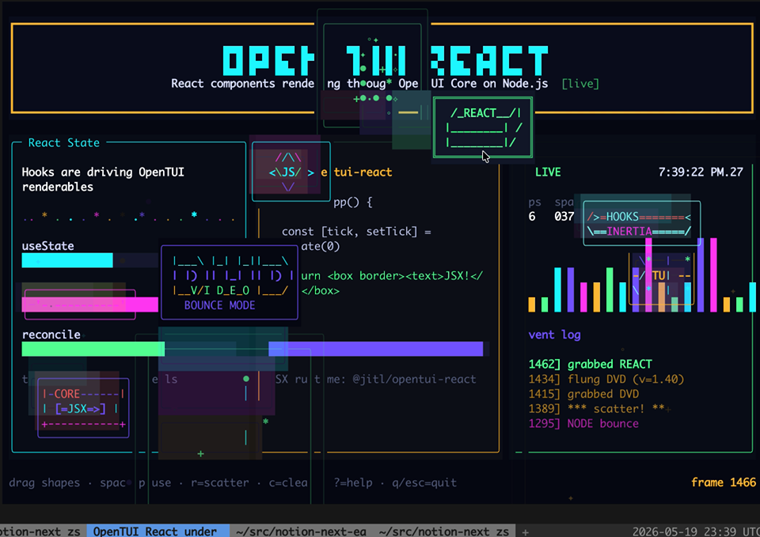

# @jitl/opentui-core / @jitl/opentui-react demos

A couple quick demos for [OpenTUI](https://opentui.com/) running under NodeJS.

```shell
npm i
npm run demo:core    # soothing
npm run demo:react   # kinda bonkers
```

- My [OpenTUI NodeJS fork](https://github.com/justjake/opentui), [PR for Node.JS support upstream](https://github.com/anomalyco/opentui/pull/939) (only supports bun right now).
- NPM packages:
  - [@jitl/opentui-core](https://npmjs.com/package/@jitl/opentui-core)
  - [@jitl/opentui-react](https://npmjs.com/package/@jitl/opentui-react)

## `¯\_(ツ)_/¯`

Click to view videos

[](https://justjake.github.io/opentui-node-demo/#core)


[](https://justjake.github.io/opentui-node-demo/#react)

