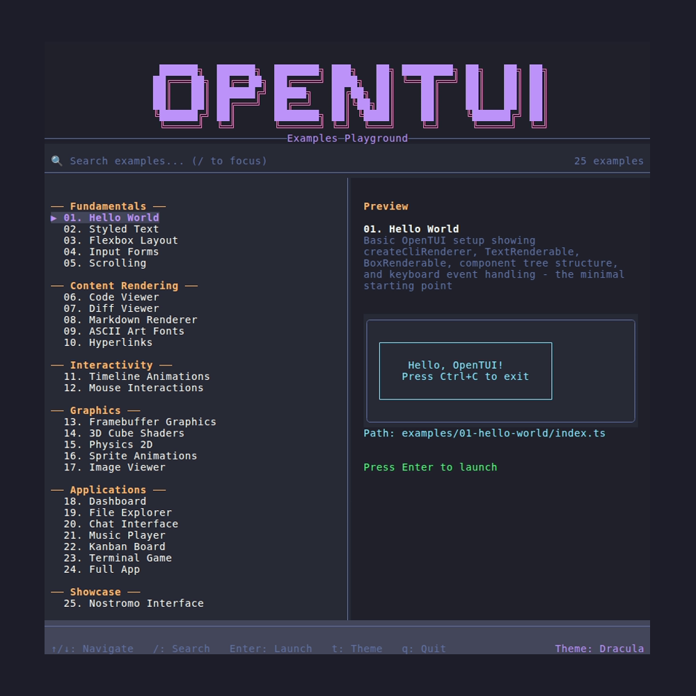
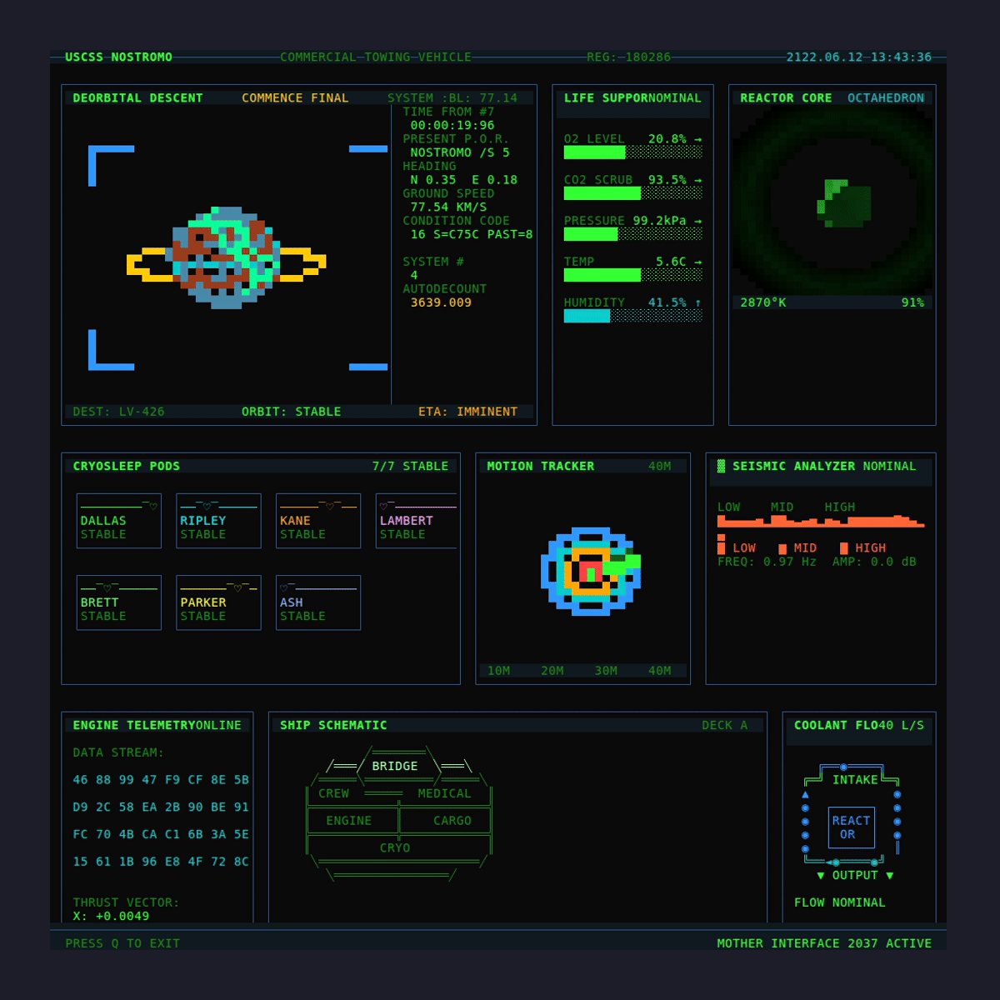
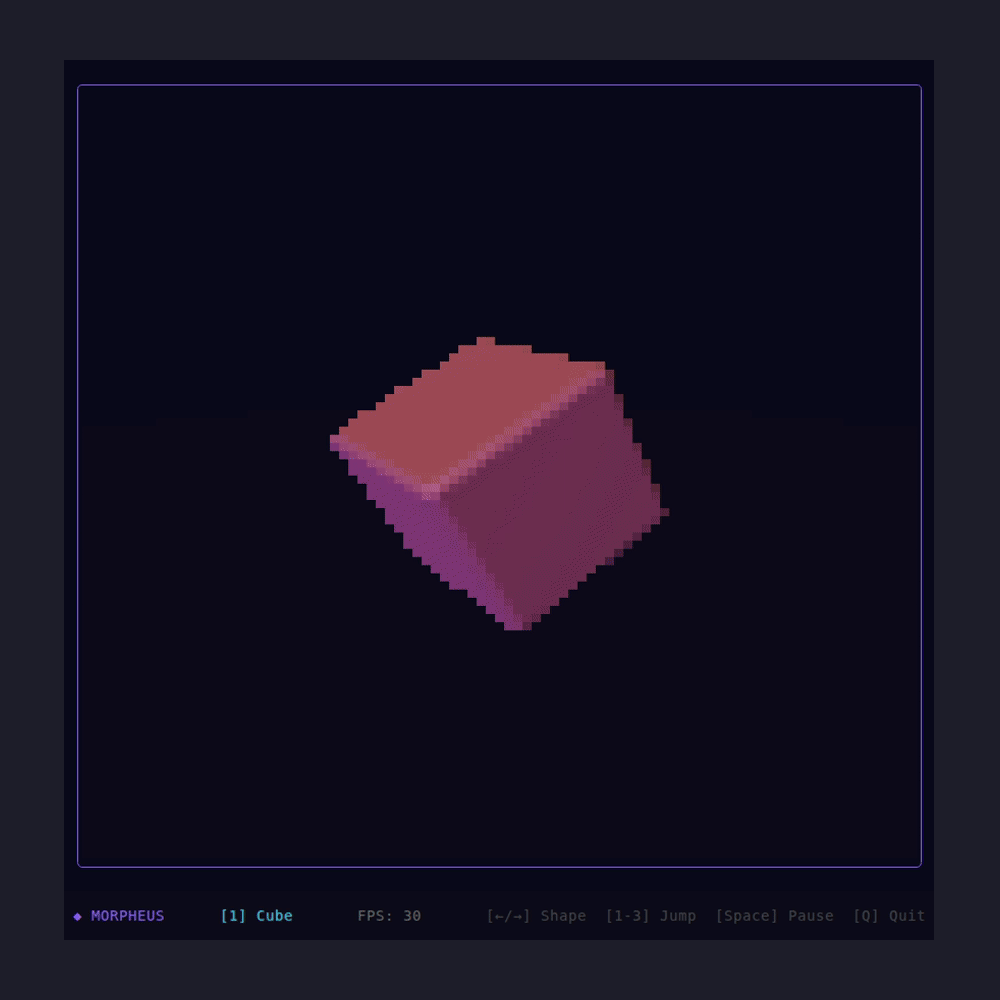
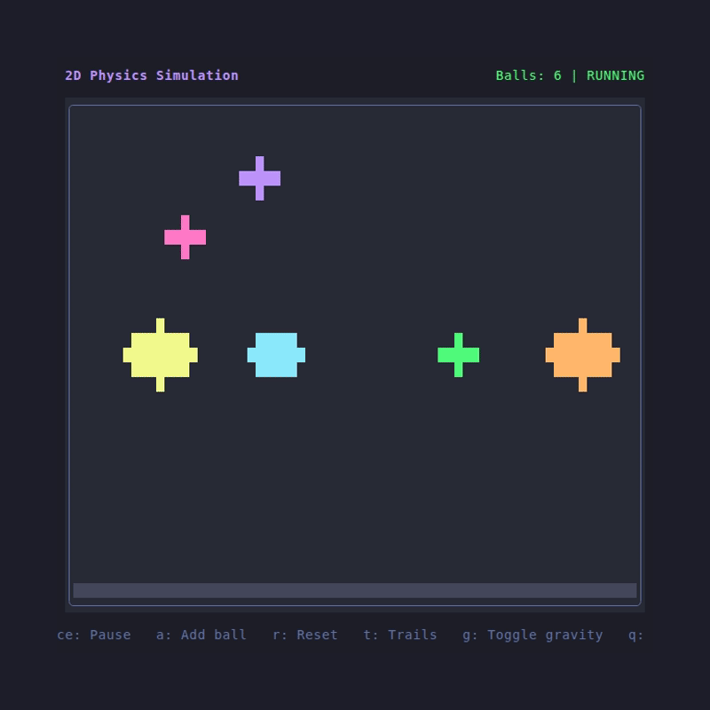
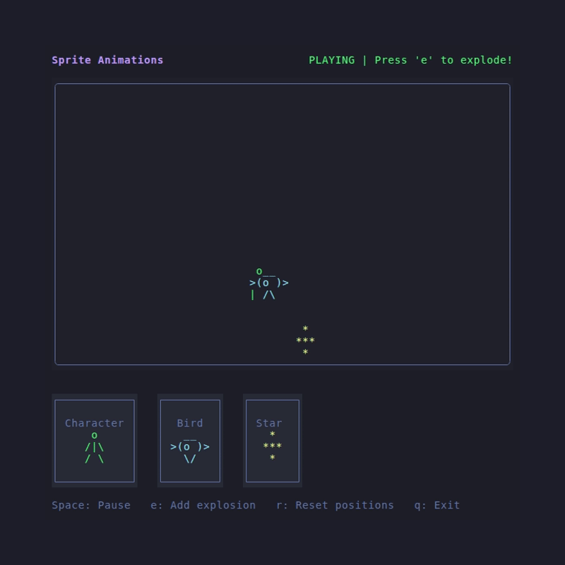
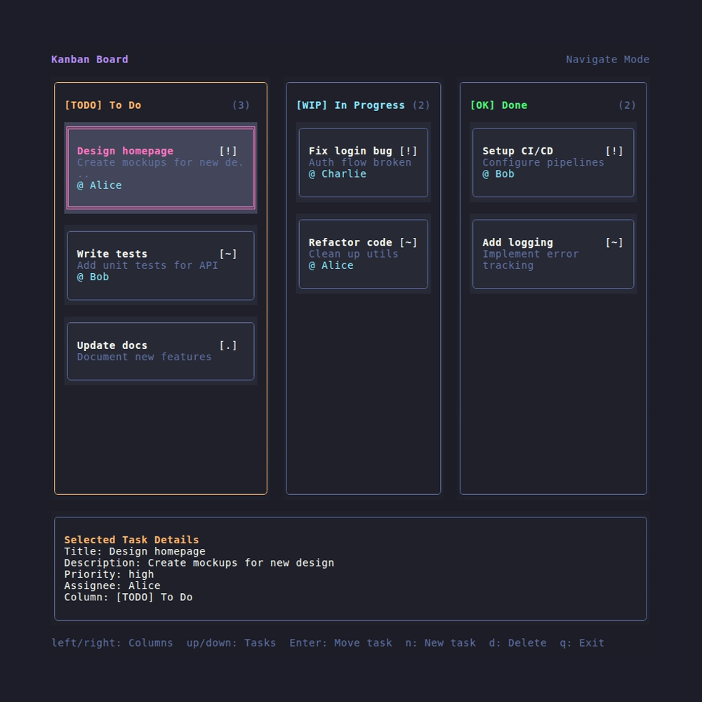
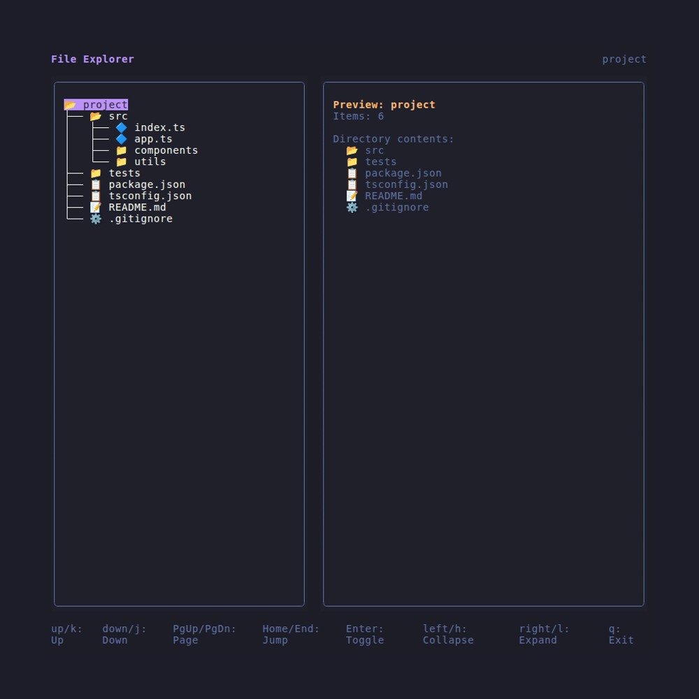

# OpenTUI Playground

> **A comprehensive demonstration of [@opentui/core](https://github.com/anomalyco/opentui) capabilities with 25 functional code examples.**

This repository serves as both a **learning resource** and a **reference implementation** for building terminal user interfaces with OpenTUI. Each example is a complete, runnable application demonstrating specific features—from basic text rendering to 3D raymarching and complete multi-view applications.

<p align="center">
  
</p>

## Why This Repository?

- **Learn by example**: Every feature has working code you can run, modify, and learn from
- **Progressive complexity**: Examples are organized from fundamentals to advanced applications
- **Copy-paste ready**: All code follows consistent patterns that work in real projects
- **Agent-friendly**: Clear structure makes it easy for AI agents to find relevant examples

---

## Gallery

<div align="center">

| | |
|:---:|:---:|
|  |  |
|  |  |
|  |  |

</div>

## Examples

| # | Example | Description |
|---|---------|-------------|
| 01 | [Hello World](examples/01-hello-world/) | Basic renderer setup and component tree |
| 02 | [Styled Text](examples/02-styled-text/) | Colors, bold, italic, and theme integration |
| 03 | [Layout Flexbox](examples/03-layout-flexbox/) | Flexbox layouts with gap, grow, and alignment |
| 04 | [Input Forms](examples/04-input-forms/) | Text inputs, dropdowns, and focus management |
| 05 | [Scrolling](examples/05-scrolling/) | Virtual scrolling with 10k+ items |
| 06 | [Code Viewer](examples/06-code-viewer/) | Syntax highlighting with language tabs |
| 07 | [Diff Viewer](examples/07-diff-viewer/) | Git-style diff rendering |
| 08 | [Markdown Renderer](examples/08-markdown-renderer/) | Headers, lists, tables, code blocks |
| 09 | [ASCII Art Fonts](examples/09-ascii-art-fonts/) | Large banner text with gradients |
| 10 | [Hyperlinks](examples/10-hyperlinks/) | Clickable terminal hyperlinks (OSC 8) |
| 11 | [Timeline Animations](examples/11-timeline-animations/) | Easing functions and color transitions |
| 12 | [Mouse Interactions](examples/12-mouse-interactions/) | Click, hover, and drag events |
| 13 | [Framebuffer Graphics](examples/13-framebuffer-graphics/) | Pixel-level drawing primitives |
| 14 | [3D Cube Shaders](examples/14-3d-cube-shaders/) | Raymarching and SDFs in the terminal |
| 15 | [Physics 2D](examples/15-physics-2d/) | Gravity and collision simulation |
| 16 | [Sprite Animations](examples/16-sprite-animations/) | Frame-by-frame sprite system |
| 17 | [Image Viewer](examples/17-image-viewer/) | ASCII art image conversion |
| 18 | [Dashboard](examples/18-dashboard/) | Multi-panel system monitoring |
| 19 | [File Explorer](examples/19-file-explorer/) | Tree navigation with preview |
| 20 | [Chat Interface](examples/20-chat-interface/) | Message bubbles and auto-scroll |
| 21 | [Music Player](examples/21-music-player/) | Visualizer and playlist UI |
| 22 | [Kanban Board](examples/22-kanban-board/) | Keyboard-driven task board |
| 23 | [Terminal Game](examples/23-terminal-game/) | Game loop and collision detection |
| 24 | [Full App](examples/24-full-app/) | Complete app with views, modals, tabs |
| 25 | [Nostromo Interface](examples/25-nostromo-interface/) | 13-panel retro-futuristic dashboard |

## Quick Start

```bash
bun install && bun run launcher
```

Or run a specific example directly:

```bash
bun run example:01                        # Run by number
bun run examples/01-hello-world/index.ts  # Run by path
```

---

## Repository Structure

```
playground_opentui/
├── launcher/                    # Interactive example selector with search & themes
├── examples/
│   ├── 01-hello-world/          # Each example is self-contained
│   │   └── index.ts             # Entry point (consistent across all examples)
│   ├── 14-3d-cube-shaders/      # Complex examples have multiple files
│   │   ├── index.ts
│   │   └── shaders/             # Supporting modules
│   └── ...
└── shared/                      # Reusable components across examples
    ├── themes/                  # Color theme definitions
    ├── widgets/                 # Pre-built UI components
    └── utils/                   # Helper utilities
```

---

## Finding Specific Functionality

Use this guide to locate examples of specific OpenTUI features:

### Core Concepts

| Feature | Example | Key File |
|---------|---------|----------|
| Renderer setup | `01-hello-world` | Basic `createCliRenderer()` pattern |
| Component tree | `01-hello-world` | Parent-child with `.add()` |
| Flexbox layout | `03-layout-flexbox` | Yoga CSS properties |
| Keyboard input | `04-input-forms` | `renderer.keyInput.on("keypress")` |
| Focus management | `04-input-forms` | Tab navigation between inputs |

### Text & Styling

| Feature | Example | What You'll Learn |
|---------|---------|-------------------|
| Colors & formatting | `02-styled-text` | Bold, italic, underline, colors |
| Theme integration | `02-styled-text` | Using `shared/themes/` |
| ASCII art text | `09-ascii-art-fonts` | Large banner text with figlet |
| Markdown rendering | `08-markdown-renderer` | Headers, lists, tables, code blocks |
| Syntax highlighting | `06-code-viewer` | Language-aware code display |
| Diff rendering | `07-diff-viewer` | Git-style unified diffs |

### Interactive Components

| Feature | Example | What You'll Learn |
|---------|---------|-------------------|
| Text inputs | `04-input-forms` | `InputRenderable` usage |
| Dropdowns/select | `04-input-forms` | `SelectRenderable` usage |
| Virtual scrolling | `05-scrolling` | `ScrollBoxRenderable` with 10k+ items |
| Clickable links | `10-hyperlinks` | OSC 8 terminal hyperlinks |
| Mouse events | `12-mouse-interactions` | Click, hover, drag handling |

### Animation & Graphics

| Feature | Example | What You'll Learn |
|---------|---------|-------------------|
| Timeline animations | `11-timeline-animations` | Easing functions, color transitions |
| Framebuffer drawing | `13-framebuffer-graphics` | Pixel-level primitives |
| 3D rendering | `14-3d-cube-shaders` | Raymarching, SDFs in terminal |
| Physics simulation | `15-physics-2d` | Gravity, collisions |
| Sprite animations | `16-sprite-animations` | Frame-by-frame animation system |
| Image display | `17-image-viewer` | ASCII art image conversion |

### Complete Applications

| Application | Example | Patterns Demonstrated |
|-------------|---------|----------------------|
| Dashboard | `18-dashboard` | Multi-panel layout, live data |
| File explorer | `19-file-explorer` | Tree navigation, file preview |
| Chat interface | `20-chat-interface` | Message bubbles, auto-scroll |
| Music player | `21-music-player` | Audio visualization, playlists |
| Kanban board | `22-kanban-board` | Keyboard-driven interaction |
| Game | `23-terminal-game` | Game loop, collision detection |
| Full app | `24-full-app` | Views, modals, tabs, routing |
| Retro UI | `25-nostromo-interface` | 13-panel complex layout |

---

## Shared Components

The `shared/` directory contains reusable components used across examples:

### Themes (`shared/themes/`)

Five built-in color themes:
- **Dracula** (default) — Purple-accented dark theme
- **Nord** — Arctic, bluish color palette
- **Monokai** — Classic warm syntax colors
- **GitHub Dark** — GitHub's dark mode colors
- **Catppuccin** — Pastel dark theme

### Widgets (`shared/widgets/`)

| Widget | Description | Used In |
|--------|-------------|---------|
| `Header` | Application header with title | Multiple apps |
| `StatusBar` | Bottom status information | Dashboard, file explorer |
| `Modal` | Overlay dialog boxes | Full app, kanban |
| `Toast` | Temporary notifications | Multiple apps |
| `ProgressBar` | Visual progress indicator | Dashboard |
| `Card` | Bordered content container | Dashboard, kanban |
| `TabBar` | Tab navigation | Code viewer, full app |
| `CommandPalette` | Searchable command menu | Launcher |
| `KeyBindingBar` | Keyboard shortcut hints | Multiple apps |

### Utilities (`shared/utils/`)

| Utility | Purpose |
|---------|---------|
| `focus-manager.ts` | Tab-based focus navigation |
| `keymap.ts` | Keyboard shortcut binding |
| `animation-presets.ts` | Common easing functions and animation helpers |
| `text-utils.ts` | Text manipulation helpers |

---

## Example Tiers

Examples are organized by complexity:

| Tier | Examples | Focus |
|------|----------|-------|
| **Fundamentals** | 01-05 | Renderer setup, layout, input, scrolling |
| **Rich Content** | 06-12 | Code, diffs, markdown, animations, links |
| **Graphics** | 13-17 | Framebuffer, 3D, physics, sprites, images |
| **Applications** | 18-25 | Complete apps combining multiple features |

---

## For AI Agents

When looking for implementation patterns:

1. **Start with `01-hello-world`** for the basic renderer pattern all examples use
2. **Check the examples table** to find the feature you need
3. **Look at `shared/`** for reusable widget patterns
4. **Complex examples** (14, 15, 16, 25) have multiple files—check subdirectories

The path alias `@shared/*` maps to `shared/*` and is used throughout the examples.
