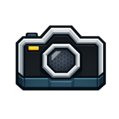

<h1>
<p align="center">
  
  <br>Honeyshots
</p>
</h1>
<p align="center">
  A component-based TUI screenshot library for OpenTUI/React
</p>

## About

A screenshot library for TUIs built on [OpenTUI](https://github.com/anomalyco/opentui), rendered with the ghostty terminal buffer.

You tag regions of your UI by name in component code; honeyshots crops the captured terminal output to each region and writes a PNG.

## Install

```sh
bun add honeyshots
```

honeyshots has no required runtime dependencies on React or OpenTUI. The `honeyshots/opentui` subpath provides an adapter for OpenTUI React apps.

## Usage

### In your app (OpenTUI + React)

Install the adapter once at startup. It's a no-op unless the `HONEYSHOTS=1` env var is set:

```tsx
import { createCliRenderer } from "@opentui/core";
import { createRoot } from "@opentui/react";
import { installAdapter } from "honeyshots/opentui";

const renderer = await createCliRenderer({...});
installAdapter(renderer);
createRoot(renderer).render(<App />);
```

Tag any `<box>` you want to capture with an `id` prop prefixed with `honeyshots:`:

```tsx
function MainScreen() {
  return (
    <box id="honeyshots:main-screen" flexDirection="column">
      {/* ... */}
    </box>
  );
}
```

For components whose root is another React component (not a bare `<box>`), use the `<Region>` wrapper — it clones the child and attaches a ref:

```tsx
import { Region } from "honeyshots/opentui";

<Region name="help-dialog">
  <DialogFrame>{/* ... */}</DialogFrame>
</Region>
```

### In your screenshot script

```ts
import { TuiHarness } from "honeyshots";

const harness = new TuiHarness({
  argv: ["bun", "run", "src/index.tsx"],
  cols: 132,
  rows: 43,
});

await harness.start();
await harness.waitForRegion("main-screen");
await harness.shoot("main-screen", "docs/shots/main-screen.png");

harness.send("?");                       // "?" opens a help dialog
await harness.waitForRegion("help-dialog");
await harness.shoot("help-dialog", "docs/shots/help-dialog.png");

await harness.close();
```

## How it works

1. Any Renderable whose `id` begins with `honeyshots:` (or that is wrapped in `<Region>`) is tracked by the adapter.
2. On each render commit, the adapter walks the OpenTUI renderable tree, collects every tagged node's `(name, x, y, width, height)`, and emits a custom OSC sequence (`OSC 5700`) with a JSON payload.
3. The harness parses the OSC stream from the app's PTY output, strips the markers before feeding the stream into the ghostty terminal buffer, and keeps a live `name → rect` map.
4. `harness.shoot(name, path)` looks up the rect, crops the captured terminal data, and renders a PNG with [@takumi-rs/core](https://github.com/takumi-rs/takumi).

## API surface

```
honeyshots
├── TuiHarness                         // PTY wrapper + region tracker
├── renderTerminalToImage(data, opts)  // TerminalData → PNG
├── cropTerminalData(data, rect)       // rect-accurate cropping
└── MarkerProtocol                     // OSC 5700 parse/emit helpers

honeyshots/opentui
├── installAdapter(renderer)           // installs the renderer hook
├── Region                              // <Region name="help-dialog">{child}</Region>
└── tagRenderable(node, name)          // imperative tag helper
```
