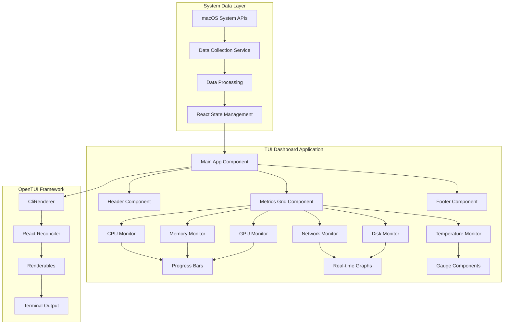

# 🏗️ TUI System Monitor Dashboard - Architecture & Implementation Plan

## 📋 Project Overview

We'll create a real-time system monitoring dashboard using OpenTUI React that displays:
- **CPU Usage** (per core + overall)
- **RAM Usage** (used, available, pressure)
- **GPU Usage** (M3 Max specific metrics)
- **Network I/O** (upload/download rates)
- **Disk I/O** (read/write rates)
- **Temperature sensors**
- **Interactive navigation** and **real-time updates**

## 🎯 Key Architecture Insights from OpenTUI

1. **React Integration**: OpenTUI has excellent React support with hooks like `useRenderer()`, `useKeyboard()`, `useTimeline()`
2. **Built-in Components**: `<box>`, `<text>`, `<scrollbox>`, `<select>`
3. **Animation System**: `Timeline` for smooth progress bars and transitions
4. **Layout Engine**: Yoga (Flexbox-like) for responsive layouts
5. **Real-time Rendering**: Built-in render loop with FPS control

## 📐 System Architecture



## 🔧 Technical Implementation Plan

### Phase 1: Foundation Setup
*Estimated: 2-3 hours*

#### 1.1 Project Structure
```
tui-dashboard/
├── src/
│   ├── components/
│   │   ├── Dashboard.tsx
│   │   ├── MetricCard.tsx
│   │   ├── ProgressBar.tsx
│   │   ├── Header.tsx
│   │   ├── CPUMonitor.tsx
│   │   ├── MemoryMonitor.tsx
│   │   ├── GPUMonitor.tsx
│   │   ├── NetworkMonitor.tsx
│   │   ├── DiskMonitor.tsx
│   │   └── TemperatureMonitor.tsx
│   ├── services/
│   │   ├── systemMetrics.ts
│   │   ├── dataCollector.ts
│   │   └── macosMetrics.ts
│   ├── hooks/
│   │   ├── useSystemMetrics.ts
│   │   ├── useRealTimeData.ts
│   │   └── useAnimatedValue.ts
│   ├── types/
│   │   ├── metrics.ts
│   │   └── components.ts
│   ├── utils/
│   │   ├── formatters.ts
│   │   └── colors.ts
│   └── main.tsx
├── package.json
├── tsconfig.json
└── README.md
```

#### 1.2 Dependencies Setup
```json
{
  "name": "tui-system-monitor",
  "version": "1.0.0",
  "type": "module",
  "dependencies": {
    "@opentui/core": "latest",
    "@opentui/react": "latest", 
    "react": "^18.0.0",
    "systeminformation": "^5.21.0"
  },
  "devDependencies": {
    "@types/react": "^18.0.0",
    "typescript": "^5.0.0",
    "bun": "latest"
  },
  "scripts": {
    "dev": "bun run src/main.tsx",
    "build": "tsc",
    "start": "bun run dist/main.js"
  }
}
```

#### 1.3 Basic OpenTUI Setup
```tsx
// src/main.tsx
import { createCliRenderer } from "@opentui/core"
import { createRoot } from "@opentui/react"
import { Dashboard } from "./components/Dashboard"

const renderer = await createCliRenderer({
  targetFps: 30,
  backgroundColor: "#1a1b26",
  exitOnCtrlC: true
})

createRoot(renderer).render(<Dashboard />)
```

### Phase 2: System Data Collection
*Estimated: 3-4 hours*

#### 2.1 System Metrics Interface
```typescript
// src/types/metrics.ts
export interface SystemMetrics {
  cpu: {
    overall: number
    cores: number[]
    temperature: number
    frequency: number
  }
  memory: {
    used: number
    total: number
    available: number
    pressure: 'low' | 'medium' | 'high'
    swap: {
      used: number
      total: number
    }
  }
  gpu: {
    utilization: number
    memory: {
      used: number
      total: number
    }
    temperature: number
    frequency: number
  }
  network: {
    interfaces: Array<{
      name: string
      upload: number
      download: number
      uploadTotal: number
      downloadTotal: number
    }>
  }
  disk: {
    read: number
    write: number
    readTotal: number
    writeTotal: number
    usage: Array<{
      mount: string
      used: number
      total: number
      percentage: number
    }>
  }
  temperatures: {
    cpu: number
    gpu: number
    ssd: number
    ambient: number
  }
  timestamp: number
}
```

#### 2.2 macOS System Data Collector
```typescript
// src/services/systemMetrics.ts
import si from 'systeminformation'

export class SystemMetricsCollector {
  private previousNetworkStats: any = null
  private previousDiskStats: any = null
  
  async collectMetrics(): Promise<SystemMetrics> {
    const [
      cpu,
      memory,
      graphics,
      networkStats,
      diskIO,
      temperatures
    ] = await Promise.all([
      si.currentLoad(),
      si.mem(),
      si.graphics(),
      si.networkStats(),
      si.disksIO(),
      si.cpuTemperature()
    ])

    return {
      cpu: this.processCPUData(cpu),
      memory: this.processMemoryData(memory),
      gpu: this.processGPUData(graphics),
      network: this.processNetworkData(networkStats),
      disk: this.processDiskData(diskIO),
      temperatures: this.processTemperatureData(temperatures),
      timestamp: Date.now()
    }
  }

  private processCPUData(cpu: any) {
    return {
      overall: Math.round(cpu.currentLoad),
      cores: cpu.cpus.map((core: any) => Math.round(core.load)),
      temperature: cpu.temperature || 0,
      frequency: cpu.avgLoad || 0
    }
  }

  // Additional processing methods...
}
```

#### 2.3 Real-time Data Hook
```typescript
// src/hooks/useSystemMetrics.ts
import { useState, useEffect } from 'react'
import { SystemMetrics } from '../types/metrics'
import { SystemMetricsCollector } from '../services/systemMetrics'

export function useSystemMetrics(updateInterval = 1000) {
  const [metrics, setMetrics] = useState<SystemMetrics | null>(null)
  const [isLoading, setIsLoading] = useState(true)
  const [error, setError] = useState<string | null>(null)
  
  useEffect(() => {
    const collector = new SystemMetricsCollector()
    
    const updateMetrics = async () => {
      try {
        const newMetrics = await collector.collectMetrics()
        setMetrics(newMetrics)
        setIsLoading(false)
        setError(null)
      } catch (err) {
        setError(err instanceof Error ? err.message : 'Unknown error')
        setIsLoading(false)
      }
    }
    
    updateMetrics() // Initial load
    const interval = setInterval(updateMetrics, updateInterval)
    
    return () => clearInterval(interval)
  }, [updateInterval])
  
  return { metrics, isLoading, error }
}
```

### Phase 3: Core UI Components
*Estimated: 4-5 hours*

#### 3.1 Dashboard Layout
```tsx
// src/components/Dashboard.tsx
import { useSystemMetrics } from '../hooks/useSystemMetrics'
import { useKeyboard, useTerminalDimensions } from '@opentui/react'
import { Header } from './Header'
import { CPUMonitor } from './CPUMonitor'
import { MemoryMonitor } from './MemoryMonitor'
import { GPUMonitor } from './GPUMonitor'
import { NetworkMonitor } from './NetworkMonitor'
import { DiskMonitor } from './DiskMonitor'
import { TemperatureMonitor } from './TemperatureMonitor'

export function Dashboard() {
  const { metrics, isLoading, error } = useSystemMetrics(1000)
  const { width, height } = useTerminalDimensions()
  
  useKeyboard((key) => {
    switch(key.name) {
      case 'q':
        process.exit(0)
        break
      case 'r':
        // Refresh data
        break
      case 'h':
        // Show help
        break
    }
  })

  if (isLoading) {
    return (
      <box style={{ 
        justifyContent: 'center', 
        alignItems: 'center', 
        height: '100%' 
      }}>
        <text>Loading system metrics...</text>
      </box>
    )
  }

  if (error) {
    return (
      <box style={{ 
        justifyContent: 'center', 
        alignItems: 'center', 
        height: '100%' 
      }}>
        <text fg="red">Error: {error}</text>
      </box>
    )
  }

  return (
    <box style={{ 
      flexDirection: 'column', 
      height: '100%',
      backgroundColor: '#1a1b26'
    }}>
      <Header metrics={metrics} />
      
      <box style={{ 
        flexDirection: 'row', 
        flexGrow: 1,
        padding: 1
      }}>
        {/* Left Column */}
        <box style={{ 
          flexDirection: 'column', 
          flexGrow: 1,
          marginRight: 1
        }}>
          <CPUMonitor data={metrics?.cpu} />
          <NetworkMonitor data={metrics?.network} />
        </box>
        
        {/* Middle Column */}
        <box style={{ 
          flexDirection: 'column', 
          flexGrow: 1,
          marginRight: 1
        }}>
          <MemoryMonitor data={metrics?.memory} />
          <DiskMonitor data={metrics?.disk} />
        </box>
        
        {/* Right Column */}
        <box style={{ 
          flexDirection: 'column', 
          flexGrow: 1
        }}>
          <GPUMonitor data={metrics?.gpu} />
          <TemperatureMonitor data={metrics?.temperatures} />
        </box>
      </box>
      
      <box style={{ 
        height: 3,
        borderTop: true,
        padding: 1,
        justifyContent: 'space-between',
        flexDirection: 'row'
      }}>
        <text>[Q]uit [R]efresh [H]elp</text>
        <text>FPS: 30 | Update: 1.0s</text>
      </box>
    </box>
  )
}
```

#### 3.2 Animated Progress Bar Component
```tsx
// src/components/ProgressBar.tsx
import { useTimeline } from '@opentui/react'
import { useEffect, useState } from 'react'

interface ProgressBarProps {
  value: number
  max?: number
  width?: number
  height?: number
  color?: string
  backgroundColor?: string
  showPercentage?: boolean
  vertical?: boolean
}

export function ProgressBar({ 
  value, 
  max = 100, 
  width = 20, 
  height = 1,
  color = '#00ff00',
  backgroundColor = '#333333',
  showPercentage = true,
  vertical = false
}: ProgressBarProps) {
  const [animatedValue, setAnimatedValue] = useState(0)
  const timeline = useTimeline({ duration: 500 })
  
  useEffect(() => {
    timeline.add(
      { value: animatedValue },
      {
        value: value,
        duration: 500,
        ease: 'easeOutCubic',
        onUpdate: (animation) => {
          setAnimatedValue(animation.targets[0].value)
        }
      }
    )
  }, [value])
  
  const percentage = Math.round((animatedValue / max) * 100)
  const fillWidth = Math.round((animatedValue / max) * width)
  
  // Color based on percentage
  const getColor = () => {
    if (percentage >= 90) return '#ff4444'
    if (percentage >= 70) return '#ffaa00'
    return color
  }
  
  const progressChar = '█'
  const emptyChar = '░'
  
  return (
    <box style={{ 
      flexDirection: vertical ? 'column' : 'row',
      alignItems: 'center'
    }}>
      <box style={{ 
        width: vertical ? height : width,
        height: vertical ? width : height,
        backgroundColor
      }}>
        <text 
          fg={getColor()}
          content={
            progressChar.repeat(fillWidth) + 
            emptyChar.repeat(width - fillWidth)
          }
        />
      </box>
      {showPercentage && (
        <text style={{ marginLeft: 1 }}>
          {percentage}%
        </text>
      )}
    </box>
  )
}
```

#### 3.3 CPU Monitor Component
```tsx
// src/components/CPUMonitor.tsx
import { ProgressBar } from './ProgressBar'

interface CPUData {
  overall: number
  cores: number[]
  temperature: number
  frequency: number
}

interface CPUMonitorProps {
  data?: CPUData
}

export function CPUMonitor({ data }: CPUMonitorProps) {
  if (!data) return null
  
  return (
    <box 
      title="CPU Usage" 
      border 
      style={{ 
        marginBottom: 1,
        padding: 1,
        height: 12
      }}
    >
      <box style={{ flexDirection: 'column' }}>
        <box style={{ marginBottom: 1 }}>
          <text>Overall: {data.overall}%</text>
        </box>
        
        <ProgressBar 
          value={data.overall} 
          width={25}
          color="#7aa2f7"
        />
        
        <box style={{ 
          flexDirection: 'column',
          marginTop: 1
        }}>
          <text style={{ marginBottom: 1 }}>Cores:</text>
          <box style={{ flexDirection: 'row', flexWrap: 'wrap' }}>
            {data.cores.map((usage, index) => (
              <box key={index} style={{ 
                marginRight: 1,
                marginBottom: 1,
                flexDirection: 'column',
                alignItems: 'center'
              }}>
                <text style={{ fontSize: 'small' }}>
                  {index}
                </text>
                <ProgressBar 
                  value={usage}
                  width={6}
                  height={1}
                  showPercentage={false}
                  color="#9ece6a"
                />
              </box>
            ))}
          </box>
        </box>
        
        <box style={{ marginTop: 1 }}>
          <text>Temp: {data.temperature}°C</text>
        </box>
      </box>
    </box>
  )
}
```

### Phase 4: Advanced Visualizations
*Estimated: 3-4 hours*

#### 4.1 Real-time Graph Component
```tsx
// src/components/MiniGraph.tsx
import { useState, useEffect } from 'react'

interface MiniGraphProps {
  data: number[]
  width?: number
  height?: number
  max?: number
  color?: string
}

export function MiniGraph({ 
  data, 
  width = 30, 
  height = 4,
  max = 100,
  color = '#7aa2f7'
}: MiniGraphProps) {
  const sparkChars = ['▁', '▂', '▃', '▄', '▅', '▆', '▇', '█']
  
  const normalizeData = (values: number[]) => {
    const maxVal = Math.max(...values, max)
    return values.map(val => Math.floor((val / maxVal) * (sparkChars.length - 1)))
  }
  
  const normalizedData = normalizeData(data.slice(-width))
  
  return (
    <box style={{ height }}>
      <text fg={color}>
        {normalizedData.map(val => sparkChars[val] || sparkChars[0]).join('')}
      </text>
    </box>
  )
}
```

#### 4.2 Network Monitor with Graphs
```tsx
// src/components/NetworkMonitor.tsx
import { useState, useEffect } from 'react'
import { MiniGraph } from './MiniGraph'
import { formatBytes } from '../utils/formatters'

interface NetworkData {
  interfaces: Array<{
    name: string
    upload: number
    download: number
    uploadTotal: number
    downloadTotal: number
  }>
}

export function NetworkMonitor({ data }: { data?: NetworkData }) {
  const [uploadHistory, setUploadHistory] = useState<number[]>([])
  const [downloadHistory, setDownloadHistory] = useState<number[]>([])
  
  useEffect(() => {
    if (data?.interfaces[0]) {
      const mainInterface = data.interfaces[0]
      setUploadHistory(prev => [...prev.slice(-29), mainInterface.upload])
      setDownloadHistory(prev => [...prev.slice(-29), mainInterface.download])
    }
  }, [data])
  
  if (!data?.interfaces[0]) return null
  
  const mainInterface = data.interfaces[0]
  
  return (
    <box 
      title="Network I/O" 
      border 
      style={{ 
        marginBottom: 1,
        padding: 1,
        height: 10
      }}
    >
      <box style={{ flexDirection: 'column' }}>
        <box style={{ marginBottom: 1 }}>
          <text>↑ Upload: {formatBytes(mainInterface.upload)}/s</text>
        </box>
        
        <box style={{ marginBottom: 1 }}>
          <text>↓ Download: {formatBytes(mainInterface.download)}/s</text>
        </box>
        
        <box style={{ marginTop: 1 }}>
          <MiniGraph 
            data={[...uploadHistory, ...downloadHistory]}
            width={25}
            height={3}
            color="#f7768e"
          />
        </box>
      </box>
    </box>
  )
}
```

### Phase 5: Interactivity & Polish
*Estimated: 2-3 hours*

#### 5.1 Keyboard Controls
```tsx
// Enhanced keyboard handling in Dashboard.tsx
useKeyboard((key) => {
  switch(key.name) {
    case 'q':
    case 'escape':
      process.exit(0)
      break
    case 'r':
      // Force refresh metrics
      break
    case 'p':
      // Toggle pause/resume
      break
    case 'h':
    case 'f1':
      // Show help modal
      break
    case '1':
      // Focus CPU monitor
      break
    case '2':
      // Focus Memory monitor
      break
    case '3':
      // Focus GPU monitor
      break
    case 'f':
      // Toggle fullscreen mode for focused component
      break
  }
})
```

#### 5.2 Responsive Layout Hook
```tsx
// src/hooks/useResponsiveLayout.ts
import { useTerminalDimensions } from '@opentui/react'

export function useResponsiveLayout() {
  const { width, height } = useTerminalDimensions()
  
  const layout = {
    isSmall: width < 80 || height < 24,
    isMedium: width >= 80 && width < 120,
    isLarge: width >= 120,
    columns: width < 80 ? 1 : width < 120 ? 2 : 3,
    showDetails: width >= 100,
    compactMode: height < 20
  }
  
  return layout
}
```

#### 5.3 Performance Optimizations
```tsx
// src/hooks/useAnimatedValue.ts
import { useState, useEffect } from 'react'
import { useTimeline } from '@opentui/react'

export function useAnimatedValue(
  targetValue: number, 
  duration = 500,
  ease = 'easeOutCubic'
) {
  const [currentValue, setCurrentValue] = useState(targetValue)
  const timeline = useTimeline({ duration })
  
  useEffect(() => {
    if (Math.abs(targetValue - currentValue) > 0.1) {
      timeline.add(
        { value: currentValue },
        {
          value: targetValue,
          duration,
          ease,
          onUpdate: (animation) => {
            setCurrentValue(animation.targets[0].value)
          }
        }
      )
    }
  }, [targetValue])
  
  return currentValue
}
```

## 🎨 Visual Design Mockup

```
┌─────────────────── System Monitor Dashboard ───────────────────┐
│ CPU: 45% │ RAM: 8.2/16GB │ GPU: 23% │ Temp: 42°C │ 12:34:56 PM │
├─────────────────────────────────────────────────────────────────┤
│ ┌─── CPU Usage ───┐ ┌─── Memory ────┐ ┌─── GPU M3 Max ─┐      │
│ │ Overall: 45%    │ │ Used: 8.2GB   │ │ Usage: 23%     │      │
│ │ ████████░░ 45%  │ │ ████████░░ 51%│ │ ██░░░░░░░░ 23% │      │
│ │                 │ │ Available:    │ │ Memory: 2.1GB  │      │
│ │ Core 0: ██████  │ │ 7.8GB         │ │ Temp: 38°C     │      │
│ │ Core 1: ████    │ │ Pressure: Low │ │                │      │
│ │ Core 2: ████    │ │               │ │                │      │
│ │ Core 3: ██      │ │               │ │                │      │
│ └─────────────────┘ └───────────────┘ └────────────────┘      │
│                                                                 │
│ ┌─── Network I/O ─┐ ┌─── Disk I/O ──┐ ┌─── Temperature ─┐      │
│ │ ↑ Upload:       │ │ Read:  45MB/s │ │ CPU: 42°C ████  │      │
│ │   1.2 MB/s      │ │ ████████░░    │ │ GPU: 38°C ███   │      │
│ │ ↓ Download:     │ │ Write: 12MB/s │ │ SSD: 35°C ██    │      │
│ │   5.8 MB/s      │ │ ███░░░░░░░    │ │                 │      │
│ │ ▁▂▃▅▄▃▂▁▂▃     │ │               │ │                 │      │
│ └─────────────────┘ └───────────────┘ └─────────────────┘      │
├─────────────────────────────────────────────────────────────────┤
│ [Q]uit [R]efresh [P]ause [H]elp     Update: 1.0s     FPS: 30   │
└─────────────────────────────────────────────────────────────────┘
```

## 🚀 Implementation Strategy

1. **Start with Phase 1** - Get basic OpenTUI setup working
2. **Build incrementally** - Add one metric type at a time
3. **Test on M3 Max** - Ensure accurate readings
4. **Optimize performance** - Monitor memory usage and FPS
5. **Add polish** - Animations, colors, responsive design

## 📊 Expected Challenges & Solutions

| Challenge | Solution |
|-----------|----------|
| M3 Max GPU metrics | Use `systeminformation` + macOS system calls |
| Real-time performance | Throttle updates, optimize re-renders |
| Terminal compatibility | Test across different terminal emulators |
| Layout responsiveness | Use OpenTUI's Yoga layout engine |
| Data accuracy | Cross-reference multiple data sources |
| Memory leaks | Proper cleanup of intervals and timelines |
| Animation performance | Use requestAnimationFrame and efficient updates |

## 🎯 Success Criteria

- ✅ Real-time system metrics display
- ✅ Smooth animations and transitions  
- ✅ Responsive layout for different terminal sizes
- ✅ Accurate M3 Max GPU monitoring
- ✅ Interactive keyboard controls
- ✅ Performance: 30 FPS with <100MB RAM usage
- ✅ Cross-platform compatibility (focus on macOS)
- ✅ Error handling and graceful degradation

## 📝 Development Notes

### OpenTUI Key Features Used
- **React Integration**: `createRoot()`, `useKeyboard()`, `useTimeline()`
- **Components**: `<box>`, `<text>`, `<input>`, `<select>`
- **Layout**: Yoga flexbox system
- **Animation**: Timeline system for smooth transitions
- **Rendering**: Optimized buffer system with FPS control

### macOS Specific Considerations
- Use `systeminformation` library for cross-platform metrics
- M3 Max GPU monitoring via Metal Performance Shaders
- Temperature sensors via IOKit framework
- Network interface monitoring
- Disk I/O statistics

### Performance Optimizations
- Debounced updates for high-frequency data
- Efficient re-rendering with React.memo
- Timeline animations for smooth transitions
- Memory usage monitoring and cleanup
- FPS limiting and frame skipping

This plan leverages OpenTUI's strengths perfectly - its React integration, animation system, and built-in components make it ideal for building this type of real-time dashboard. The modular architecture ensures we can build and test incrementally.